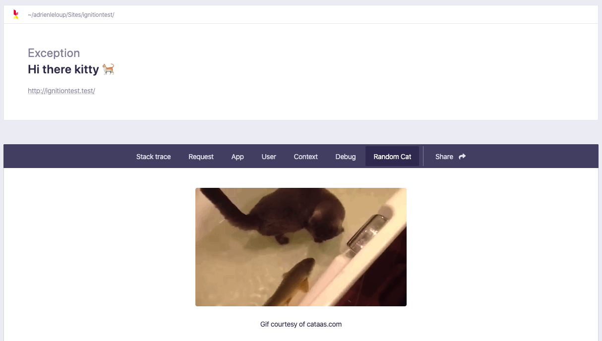

# Because the internet started with cats...

Humor me for a minute. You've been debugging this critical problem for hours, your client is spamming your e-mail and it is now 4:32 in the morning. Your client really should go to sleep and leave you alone, but there they are. And so are you.

You need a cat gif. You're welcome.



## Installation

You can install the package in to a Laravel app that uses [Ignition](https://flareapp.io) via composer:

```bash
composer require voidgraphics/ignition-cat
```

## Usage

Click on the "Random Cat" tab on your Ignition screen to see the tool provided by this package.

### Testing

``` bash
composer test
```

### Changelog

Please see [CHANGELOG](CHANGELOG.md) for more information on what has changed recently.

## Contributing

Please see [CONTRIBUTING](CONTRIBUTING.md) for details.

### Security

If you discover any security related issues, please email adrien@whitecube.be instead of using the issue tracker.

## Credits

- [Adrien Leloup](https://github.com/voidgraphics)

## License

The MIT License (MIT). Please see [License File](LICENSE.md) for more information.
